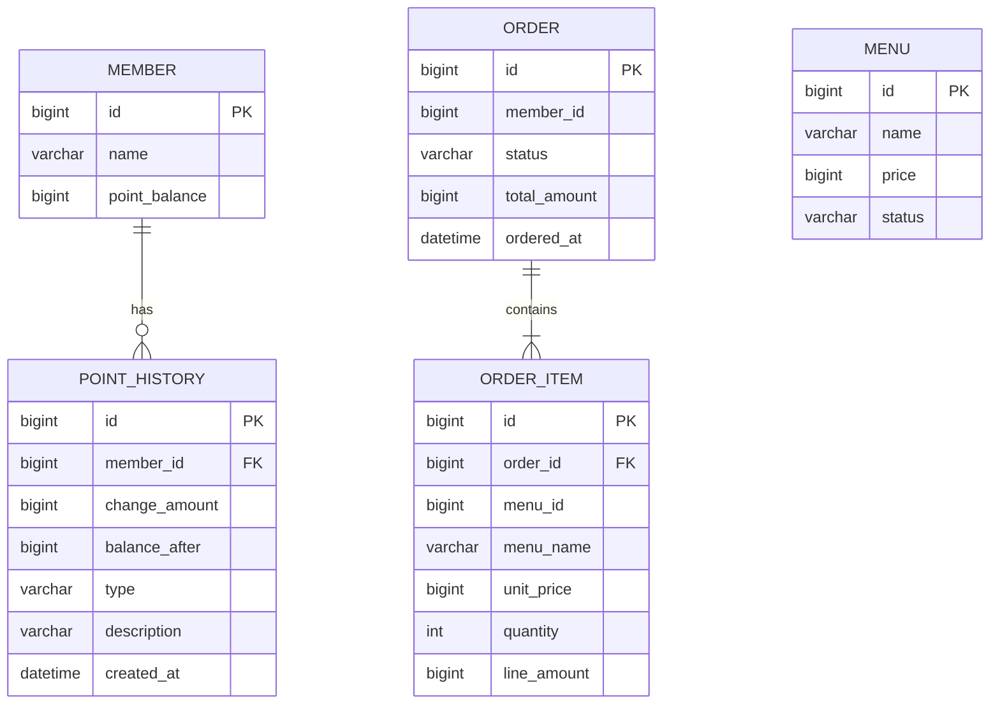

# Coffee Order System

메뉴, 회원 포인트, 주문, 최근 7일 인기 메뉴를 제공하는 Spring Boot 학습 프로젝트다. 주문 원본과 정확한 인기 메뉴 집계는 관계형 DB가 담당하고, Redis는 재생성 가능한 조회 결과 캐시, Kafka는 주문 커밋 이후 캐시 무효화 이벤트 전달에 사용한다.

## 기술 스택

| 구분 | 기술 |
| --- | --- |
| Language | Java 21 |
| Framework | Spring Boot 3.3.5, Spring Web, Bean Validation |
| Persistence | Spring Data JPA, MySQL 8.4, 테스트용 H2 |
| Cache | Redis 7.4, `StringRedisTemplate`, Jackson JSON |
| Event | Spring Application Event, Spring Kafka, Kafka 3.8 |
| Test / Build | JUnit 5, AssertJ, Mockito, MockMvc, Embedded Kafka, Gradle |
| Local Infra | Docker Compose |

## 실행 방법

필수 환경은 Java 21과 Docker다.

```bash
cp .env.example .env
docker compose up -d
./gradlew bootRun
```

Spring Boot가 셸의 `.env`를 자동 로드하지는 않는다. `docker compose`는 `.env`를 읽지만 애플리케이션 실행 전에는 해당 값을 셸 환경변수로 내보내거나 IDE 실행 설정에 등록해야 한다. 기본값을 쓸 수도 있지만 `application-local.yml`의 기본 DB명 `cafe`와 Compose 기본 DB명 `coffee_order`가 다르므로 `.env.example`의 `DB_URL` 사용을 권장한다.

| 환경변수 | 예시 / 역할 |
| --- | --- |
| `DB_URL` | `jdbc:mysql://localhost:3306/coffee_order` |
| `DB_USERNAME`, `DB_PASSWORD` | MySQL 인증 정보 |
| `REDIS_HOST`, `REDIS_PORT` | 인기 메뉴 캐시 Redis |
| `KAFKA_BOOTSTRAP_SERVERS` | 주문 완료 이벤트 Kafka broker |
| `KAFKA_ORDER_COMPLETED_TOPIC` | 기본 `coffee.order.completed.v1` |
| `KAFKA_ORDER_COMPLETED_GROUP` | 기본 `ranking-order-completed-v1` |
| `RANKING_CACHE_TTL` | 기본 `5m` |

인프라 상태 확인과 종료:

```bash
docker compose ps
docker compose config
docker compose down
```

## 구현 범위

- 메뉴 등록, 판매 중 메뉴 목록, 메뉴 단건 조회
- 회원 생성·조회, 포인트 충전·잔액 조회
- 포인트 적립/사용 이력 저장과 DB 비관적 락 동시성 제어
- 서버 저장 가격 기준 주문 금액 계산, 포인트 결제, 주문 저장
- 주문 단건 및 회원별 주문 목록 조회
- 완료 주문 중 현재 시각 기준 최근 7일 판매 수량 TOP3 조회
- Redis Cache Aside, JSON 직렬화, 5분 TTL, 장애 시 DB fallback
- 주문 커밋 후 Spring transactional event → Kafka 발행 → Consumer 캐시 삭제
- Kafka eventId 기반 JVM 메모리 중복 처리 방지와 고정 backoff 재시도

미구현/향후 개선 범위는 PointHistory 조회 API, 주문 취소 API, 운영용 DB migration 도구, Kafka Outbox/DLT, 영구 중복 처리 저장소, 실데이터 기반 부하·실행 계획 측정이다. `@Async`는 적용하지 않았고 Kafka listener가 비동기 후속 처리를 담당한다.

## API

모든 일반 응답은 `{ "success", "code", "message", "data" }` 형태의 `ApiResponse<T>`로 감싼다.

| Method | Path | 설명 |
| --- | --- | --- |
| `POST` | `/api/v1/menus` | 메뉴 등록 (`name`, `price`) |
| `GET` | `/api/v1/menus` | `ON_SALE` 메뉴 목록 |
| `GET` | `/api/v1/menus/{menuId}` | 메뉴 단건 조회 |
| `POST` | `/api/v1/members` | 회원 생성 (`name`) |
| `GET` | `/api/v1/members/{memberId}` | 회원 조회 |
| `POST` | `/api/v1/members/{memberId}/points/charge` | 포인트 충전 (`amount`) |
| `GET` | `/api/v1/members/{memberId}/points` | 포인트 잔액 조회 |
| `POST` | `/api/v1/orders` | 주문 생성 |
| `GET` | `/api/v1/orders/{orderId}` | 주문 단건 조회 |
| `GET` | `/api/v1/orders?memberId={memberId}` | 회원 주문 목록 |
| `GET` | `/api/v1/menus/popular` | 최근 7일 인기 메뉴 TOP3 |

주문 요청 예시:

```json
{
  "memberId": 1,
  "items": [
    { "menuId": 1, "quantity": 2 }
  ]
}
```

인기 메뉴의 `data` 예시:

```json
{
  "menus": [
    {
      "rank": 1,
      "menuId": 1,
      "menuName": "Americano",
      "totalQuantity": 12,
      "orderCount": 7
    }
  ]
}
```

주문 금액은 요청 가격이 아니라 DB에 저장된 메뉴 가격으로 계산한다. 잘못된 입력과 존재하지 않는 자원, 판매 중지 메뉴, 포인트 부족은 공통 오류 응답으로 변환된다.

## 인기 메뉴 집계와 Redis 선택

`PopularMenuService`가 한 번의 기준 시각 `endAt = LocalDateTime.now()`를 만들고 `startAt = endAt.minusDays(7)`을 계산해 Repository에 전달한다. JPQL은 다음 조건으로 집계한다.

- `OrderStatus.COMPLETED`
- `orderedAt >= startAt AND orderedAt < endAt` (시작 포함, 종료 미포함)
- 메뉴별 `SUM(quantity)` 내림차순
- 동률이면 `COUNT(order)` 내림차순, 다시 동률이면 메뉴 ID 오름차순
- `PageRequest.of(0, 3)`으로 최대 3건

Redis에는 ZSET이 아니라 DB가 계산한 TOP3 DTO 목록 전체를 JSON 문자열로 저장한다.

- key: `popular-menus:v2:last-7-days:top:3`
- value: `List<PopularMenuResponse>` JSON
- TTL: 기본 5분, `RANKING_CACHE_TTL`로 변경 가능
- cache miss/깨진 JSON/Redis 장애: DB 재집계 후 캐시 저장 시도
- 갱신: 주문 커밋 뒤 Kafka Consumer가 key를 삭제하고 다음 조회가 재생성
- 이벤트 유실 또는 삭제 실패: TTL 만료 뒤 복구

ZSET은 실시간 점수 증가와 순위 조회에는 유리하지만, 누적 score 하나로는 7일 전 판매량이 매 순간 빠지는 슬라이딩 윈도우를 정확히 표현할 수 없다. 날짜별 ZSET 7개 합산, 주문 단위 timestamp 보관과 제거, 또는 주기적 전체 재집계가 추가로 필요하다. 현재 과제 규모와 5분 갱신 허용 범위에서는 DB가 시간 조건과 상태를 정확히 집계하고 Redis가 작은 결과만 캐싱하는 방식이 구현 복잡도·정합성 대비 효율적이다.

JSON 캐시의 장점은 조회 한 번으로 API 결과 전체를 얻고 DB를 단일 진실 공급원으로 유지한다는 점이다. 한계는 TTL 동안 7일 경계가 이동해도 캐시가 그대로이고, 주문 이벤트 전달 지연 시 일시적으로 이전 결과가 보일 수 있다는 점이다. 실시간 랭킹이나 트래픽이 커지면 날짜별 집계 테이블/일별 ZSET을 만들고 최근 7개 버킷을 합산하는 구조를 검토한다.

## 포인트와 트랜잭션

현재 모델에는 별도 `Point` 엔티티가 없고 `Member.pointBalance`가 잔액을 소유한다. `PointHistory`는 잔액 소유자인 `Member`를 참조하며 다음을 저장한다.

- `type`: `EARN`, `USE`
- `changeAmount`: 적립은 양수, 사용은 음수
- `balanceAfter`: 변경 직후 잔액
- `description`, `createdAt`

`PointService.charge/use`는 `MemberRepository.findByIdForUpdate()`의 `PESSIMISTIC_WRITE` 락으로 같은 회원의 변경을 직렬화한다. 잔액 변경이 성공한 다음 이력을 저장하며 두 작업은 같은 `@Transactional` 범위다. 부족 검증이 실패하면 이력 저장 코드에 도달하지 않고, 저장 중 예외가 나도 잔액과 이력이 함께 롤백된다. 주문 생성에서는 `OrderService.create` 트랜잭션에 `PointService.use`가 참여하므로 포인트 사용 이력, 잔액, 주문, 주문 항목이 한꺼번에 커밋 또는 롤백된다.

## 이벤트 처리

```text
주문 저장 + 포인트 사용 (DB transaction)
  -> 내부 OrderCompletedEvent 발행
  -> commit 성공 후 TransactionalEventListener(AFTER_COMMIT)
  -> Kafka Producer
  -> coffee.order.completed.v1
  -> Kafka Consumer
  -> 인기 메뉴 JSON cache 삭제
```

Kafka Producer 전송은 비동기 callback으로 결과를 기록한다. DB commit과 Kafka publish는 원자적이지 않아 발행 유실 가능성이 있으며 Outbox는 미구현이다. Consumer는 eventId를 JVM `ConcurrentHashMap` 기반 Set에 기록하므로 재시작·다중 인스턴스 전체에 대한 영구 멱등성은 보장하지 않는다. 처리 실패는 1초 간격 2회 재시도하고 최종 실패를 로그로 남긴다.

## 도메인과 ERD



`Order.memberId`와 `OrderItem.menuId`는 의도적으로 JPA 연관관계가 아닌 식별자/주문 시점 스냅샷이다. 실제 FK 연관관계는 `OrderItem → Order`, `PointHistory → Member`다.

## 인덱스와 성능

- `orders(status, ordered_at)`: 완료 상태와 최근 7일 범위 필터 지원
- `order_items(order_id, menu_id)`: 주문 조인과 메뉴 식별 지원
- `point_histories(member_id, created_at)`: 회원별 이력 시간순 조회 확장 지원

인기 메뉴는 Entity 전체 로딩 없이 interface projection으로 DB에서 `SUM/COUNT/GROUP BY`를 수행한다. 인덱스 선언은 적용했지만 MySQL 실데이터에서 `EXPLAIN ANALYZE` 전후 수치는 아직 측정하지 않았다. 쓰기 비용과 데이터 분포를 포함한 검증이 향후 과제다.

## 디렉토리 구조

```text
src/main/java/com/jihyeon/coffeeorder
├── global/{config,exception,response}
├── menu/{controller,dto,entity,repository,service}
├── member/{controller,dto,entity,repository,service}
├── order/{controller,dto,entity,event,repository,service}
└── ranking/{cache,controller,dto,event,repository,service}
src/test/java/com/jihyeon/coffeeorder
study/
```

## 테스트

테스트 프로필은 H2를 사용하고 일반 Kafka listener 자동 시작을 끈다. Kafka 통합 테스트는 Embedded Kafka를 사용하며 외부 MySQL·Redis·Kafka가 없어도 전체 테스트를 실행할 수 있다. Redis 캐시 테스트는 Mockito 기반이다.

```bash
./gradlew clean test
./gradlew build
```

주요 검증 범위는 API validation/응답, JPA 조회, 최근 7일·상태·수량·TOP3·동률 정렬, Redis JSON/TTL/장애 fallback, 포인트 잔액·이력·실패 rollback·비관적 락 동시성, 주문 원자성, Spring/Kafka 이벤트 직렬화·소비·중복 처리다.
